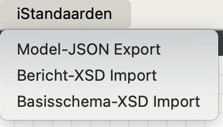

# StarUML iStandaard Extension

StarUML-extensie voor de Migratie van huidige BizzDesign-outputs naar een StarUML-project met UML-modellen.

## iStandaard Menu

De extensie biedt een extra hoofd-menu voor de iStandaard-functionaliteit.

Hieronder wordt de functionaliteit per menu-optie samengevat.

## Model-JSON Export

Zal een UML-model dat is opgesteld volgens het iStandaard-berichten model exporteren in een JSON-formaat met de bijbehorende JSON-LD Context.

(PM)

## Bericht-XSD Import

Importeren van 1-of meerdere iStandaard-bericht specificaties in het XSD-formaat die vanuit BizzDesign zijn gegenereerd.

Bevat momenteel de volgende functionaliteiten:
- Toevoegen UML-Package *Berichten* (indien nog geen aanwezig)
- Toevoegen van UML-Package per *Bericht* (indien nog niet aanwezig)
  - Toevoegen van een UML-Class per *Berichtklasse*
    - Overnemen van de *Berichtklasse* documentatie
      - Toevoegen van een UML-Attribuut per *Berichtklasse element*
        - Overnemen van de *Berichtklasse element* documentatie
        - Overnemen van de *Berichtklasse element* kardinaliteit als *multiplicity* eigenschap
        - Overnemen van het *Berichtklasse element* dataType
          - De referentie naar een *dataType* in het **Gegevens-model* (indien aanwezig)
          - Of de naam van het *dataType* (indien niet aanwezig)
        - Overnemen van de *Berichtklasse element* sleutel-indicator als *isId* eigenschap
    - Toevoegen van *Berichtklasse-relaties* als UML-Associaties als onderdeel van de UML-Class (voor de Parent-Berichtklasse)

# Referenties
- [Developing StarUML Extensiions](https://docs.staruml.io/developing-extensions)
- [StarUML-API v2.0.0](https://files.staruml.io/api-docs/2.0.0/api/index.html)
- [xml-js](https://github.com/nashwaan/xml-js)